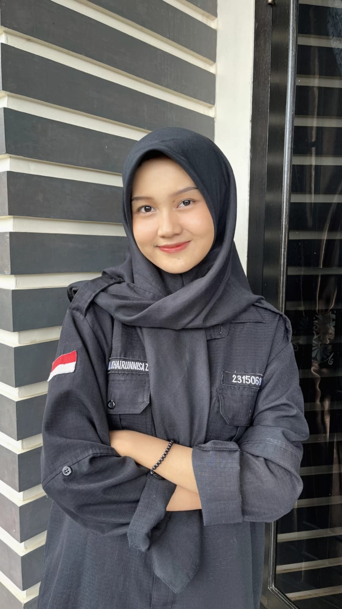

<html lang="id">
<head>
    <meta charset="UTF-8">
    <meta name="viewport" content="width=device-width, initial-scale=1.0">
    <title>Mutiara Khairunnisa Zulkifli | Portfolio & Materi Kuliah</title>
    <link rel="stylesheet" href="https://cdnjs.cloudflare.com/ajax/libs/font-awesome/6.4.0/css/all.min.css">
    
</head>
<body>
    <header>
        

            <nav>
                

                    <i class="fas fa-code"></i>
                    MutiaraKZ
                

                <ul class="nav-links">
                    <li><a href="#home"><i class="fas fa-home"></i> Beranda</a></li>
                    <li><a href="#analysis"><i class="fas fa-chart-pie"></i> Analisis</a></li>
                    <li><a href="#academic-plan"><i class="fas fa-book"></i> Akademik</a></li> 
                    <li><a href="#philosophy"><i class="fas fa-lightbulb"></i> Open Source</a></li>
                    <li><a href="#contact"><i class="fas fa-envelope"></i> Kontak</a></li>
                </ul>
                

                    <i class="fas fa-bars"></i>
                

            </nav>
        

    </header>

    <section id="home" class="hero">
        

            

                
            

            <h1>Mutiara Khairunnisa Zulkifli</h1>
            
Mahasiswa Teknik Informatika | Frontend Developer

            
Selamat datang di laman pribadi saya yang berisi portofolio dan materi kuliah Kapita Selekta.

            

                <i class="fas fa-id-card"></i> NPM: 2315061060
            

        

    </section>

    <section id="analysis" class="section">
        

            <h2 class="section-title">Analisis Kapita Selekta</h2>
            
Analisis SWOT dan Porter's Five Forces untuk Frontend Web Development

            
            

                

                    

                        

                            <i class="fas fa-swot-analysis"></i>
                        

                        <h3>Analisis SWOT</h3>
                    

                    

                        

                            <h4><i class="fas fa-plus-circle"></i> Strength</h4>
                            <ul>
                                <li>Menguasai dasar HTML & CSS</li>
                                <li>Bisa menggunakan Bootstrap untuk desain responsif</li>
                                <li>Teliti dalam layout dan visual</li>
                                <li>Termotivasi untuk terus belajar</li>
                            </ul>
                        

                        

                            <h4><i class="fas fa-minus-circle"></i> Weakness</h4>
                            <ul>
                                <li>Belum familiar dengan JavaScript & framework modern</li>
                                <li>Masih bergantung pada template</li>
                                <li>Minim pengalaman optimasi performa & testing</li>
                            </ul>
                        

                        

                            <h4><i class="fas fa-arrow-up-right-from-square"></i> Opportunity</h4>
                            <ul>
                                <li>Banyak sumber belajar online untuk tingkatkan skill</li>
                                <li>Permintaan besar untuk frontend developer</li>
                                <li>Digitalisasi membuka peluang skripsi & KP</li>
                                <li>Bisa mulai bangun portofolio kecil</li>
                            </ul>
                        

                        

                            <h4><i class="fas fa-exclamation-triangle"></i> Threat</h4>
                            <ul>
                                <li>Persaingan ketat dengan developer lebih mahir</li>
                                <li>Website builder bisa gantikan web sederhana</li>
                                <li>Teknologi frontend cepat berubah</li>
                                <li>Ekspektasi industri cukup tinggi</li>
                            </ul>
                        

                    

                

                

                    

                        

                            <i class="fas fa-chess-board"></i>
                        

                        <h3>Porter's Five Forces</h3>
                    

                    

                        

                            

                                01. Threat of New Entrants
                                Sangat Tinggi
                            

                            
Banyak kursus online dan bootcamp yang menawarkan pembelajaran intensif, sehingga jumlah pendatang baru semakin besar.

                            

                        

                        

                            

                                02. Bargaining Power of Supplier
                                Rendah - Sedang
                            

                            
Framework, library, dan browser bersifat open-source dan memiliki banyak alternatif, sehingga kekuatan tawar mereka tidak terlalu dominan.

                            

                        

                        

                            

                                03. Bargaining Power of Buyers
                                Tinggi
                            

                            
Perusahaan dan klien memiliki banyak opsi pengembang, sehingga dapat menekan harga dan waktu pengerjaan.

                            

                        

                        

                            

                                04. Threat of Substitutes
                                Tinggi
                            

                            
Website builder, CMS, dan platform SaaS mampu menggantikan sebagian besar kebutuhan web standar.

                            

                        

                        

                            

                                05. Industry Rivalry
                                Sangat Ketat
                            

                            
Frontend menjadi bidang populer sehingga banyak developer bersaing di tingkat lokal maupun global.

                            

                        

                    

                

            

        

    </section>

    <section id="academic-plan" class="section">
        

            <h2 class="section-title">Rencana Akademik</h2>
            
Rencana Kerja Praktik (KP) dan Skripsi di Bidang Rekayasa Perangkat Lunak

            
            

                
                

                    <h3><i class="fas fa-clipboard-list"></i> Kerja Praktik (KP)</h3>
                    <h4>Implementasi Sistem Penjadwalan Kuliah Otomatis Berbasis Web dengan Constraint-Based Scheduling dan Fitur Validasi Bentrok Jadwal.</h4>
                    
Rencana KP ini berfokus pada penerapan dasar-dasar frontend web development dalam membangun antarmuka pengguna yang intuitif untuk sistem penjadwalan. Tujuannya adalah mengimplementasikan tampilan jadwal, formulir input constraint, dan menampilkan hasil validasi bentrok jadwal secara visual dan user-friendly.

                    
KP ini menjadi batu loncatan praktik untuk memahami alur kerja dan kebutuhan fungsional sebelum pengembangan proyek akhir skripsi yang lebih kompleks.

                

                

                    <h3><i class="fas fa-graduation-cap"></i> Skripsi</h3>
                    <h4>Perancangan dan Implementasi Aplikasi Penjadwalan Kuliah Otomatis Berbasis Web dan Mobile dengan Pendekatan Constraint-Based Scheduling serta Evaluasi Usability.</h4>
                    
Proyek skripsi ini merupakan pengembangan holistik dari KP, mencakup perancangan sistem dari hulu ke hilir, pengembangan aplikasi multi-platform (Web dan Mobile), serta penerapan algoritma Constraint-Based Scheduling yang solid.

                    
Fokus akhirnya adalah melakukan evaluasi usability menggunakan metodologi terstruktur untuk memastikan sistem tidak hanya berfungsi secara teknis tetapi juga mudah dan efektif digunakan oleh pengguna, baik admin maupun mahasiswa.

                

                
            

        

    </section>

    <section id="philosophy" class="section philosophy">
        

            <h2 class="section-title">Filosofi Open Source</h2>
            
Konsep dan pentingnya Open Source dalam pengembangan perangkat lunak

            
            

                

                    Open Source Philosophy adalah pendekatan pengembangan perangkat lunak yang menekankan pada transparansi, kolaborasi, dan kebebasan dalam mengakses, memodifikasi, dan mendistribusikan kode sumber. 
                    Filosofi ini telah mengubah landscape teknologi modern dan menjadi fondasi bagi inovasi di dunia pengembangan web dan software.
                

                
                

                    

                        
 <i class="fas fa-lock-open"></i> 

                        <h3>Transparansi</h3>
                        
Kode sumber terbuka untuk dilihat dan diaudit oleh siapa saja, menciptakan kepercayaan dan akuntabilitas dalam pengembangan software.

                    

                    

                        
 <i class="fas fa-users"></i> 

                        <h3>Kolaborasi</h3>
                        
Developer dari seluruh dunia dapat berkontribusi, memperbaiki bug, dan menambahkan fitur baru, mempercepat inovasi dan perbaikan.

                    

                    

                        
 <i class="fas fa-rocket"></i> 

                        <h3>Inovasi</h3>
                        
Open Source mendorong inovasi cepat melalui berbagi pengetahuan dan kode yang dapat digunakan kembali untuk membangun solusi yang lebih baik.

                    

                    

                        
 <i class="fas fa-graduation-cap"></i> 

                        <h3>Pembelajaran</h3>
                        
Memberikan kesempatan belajar yang luar biasa bagi developer pemula dan profesional dengan mempelajari kode dari proyek-proyek real-world.

                    

                

                

                    Dalam konteks Frontend Development, filosofi open source memungkinkan developer untuk memanfaatkan library dan framework yang sudah terbukti, 
                    berkontribusi pada komunitas, dan terus mengembangkan skill melalui kolaborasi dengan developer lainnya di seluruh dunia.
                

            

        

    </section>

    <footer id="contact">
        

            

                

                    <h3>Tentang Saya</h3>
                    
Mahasiswa Teknik Informatika yang bersemangat dalam pengembangan web frontend dan tertarik dengan teknologi terkini.

                    

                        <a href="https://www.linkedin.com/in/mutiara-khairunnisa-zulkifli-15692b293 " class="social-link" target="_blank"><i class="fab fa-linkedin"></i></a>
                        <a href="https://github.com/muttzuuy/KapitaSelekta" class="social-link" target="_blank"><i class="fab fa-github"></i></a>
                        <a href="https://www.instagram.com/muttzuu" class="social-link" target="_blank"><i class="fab fa-instagram"></i></a>
                        <a href="#" class="social-link"><i class="fab fa-twitter"></i></a>
                    

                

                

                    <h3>Kontak Saya (Contact Me)</h3>
                    
<i class="fas fa-envelope"></i> mutiarakhzz88@gmail.com

                    
<i class="fab fa-whatsapp"></i> WhatsApp: <a href="https://wa.me/6281367865908" style="color:white; text-decoration:none;">081367865908</a>

                    
<i class="fas fa-map-marker-alt"></i> Bandar Lampung, Indonesia

                

                

                    <h3>Pendidikan</h3>
                    
<i class="fas fa-university"></i> Universitas Lampung

                    
<i class="fas fa-code"></i> Teknik Informatika

                    
<i class="fas fa-id-card"></i> NPM: 2315061060

                

            

            

                
&copy; 2025 Mutiara Khairunnisa Zulkifli. Dibuat dengan <i class="fas fa-heart" style="color: var(--secondary);"></i> 

            

        

    </footer>

    
</body>
</html>
